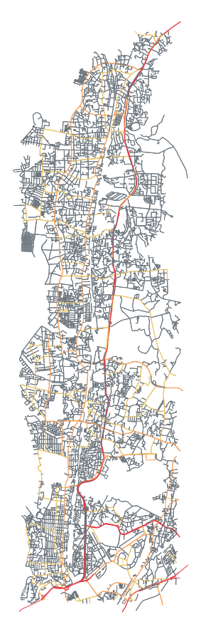
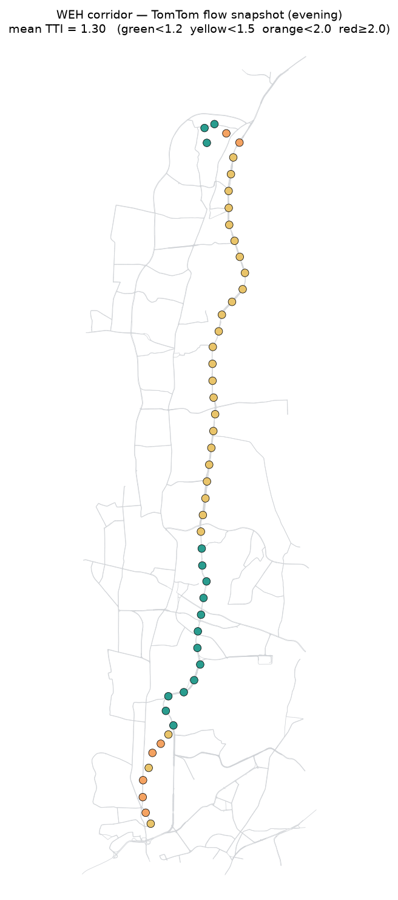
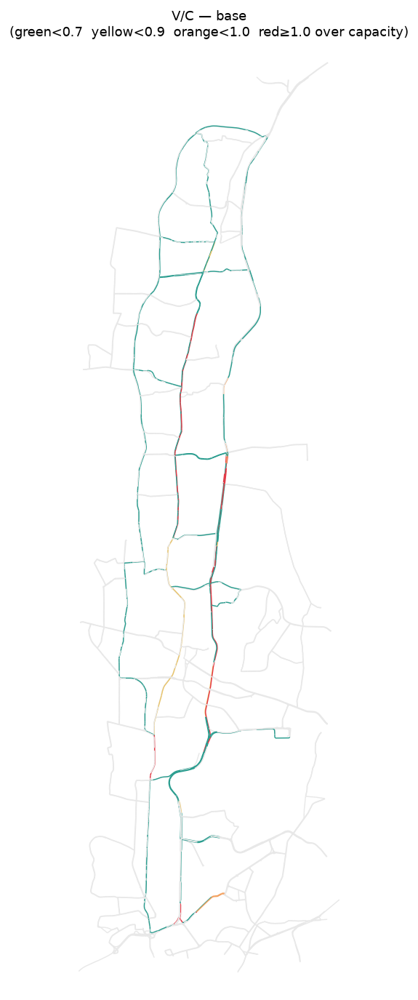
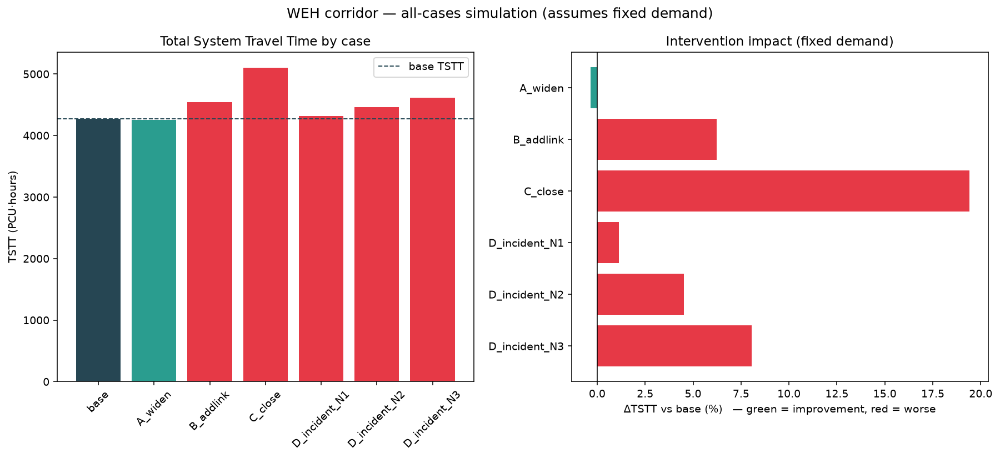
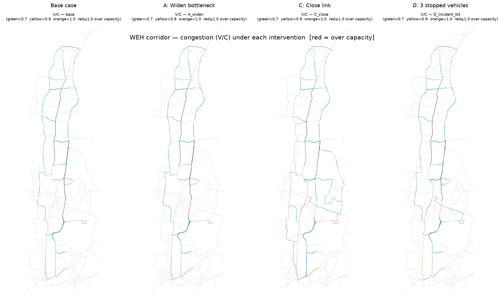
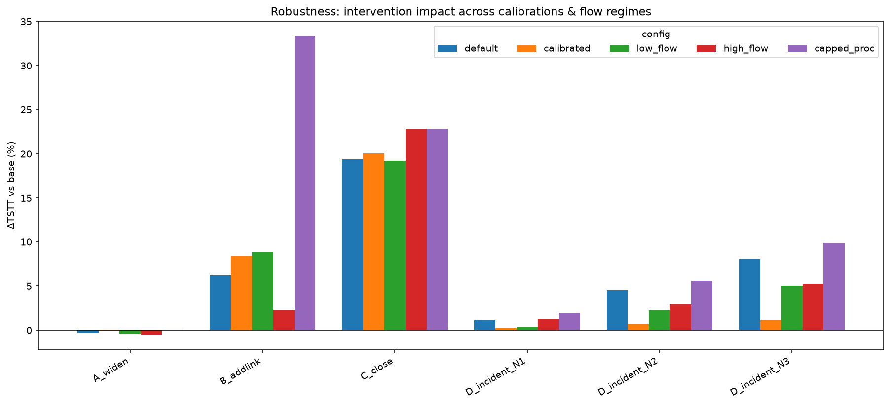

# Mumbai Traffic Network Planning & Decision-Support Tool

A computational tool that models Mumbai's road network, finds where it chokes, and tests
**"what if we build X?"** infrastructure changes — *before* anyone pours concrete.

> **The one question it answers:** *"If we widen this road / build this link / a vehicle
> breaks down here — does the corridor get better or worse, and by how much?"*

It works on **planning timescales** (months/years), not live navigation. Pilot area: the
**Western Express Highway (WEH), Dahisar → Bandra (~25 km)** — Mumbai's most notorious
commuter corridor.

---

## 1. The problem, in plain terms

Mumbai's roads are saturated. Planners constantly face expensive choices: widen a highway,
build a new connector, add a flyover. But roads are not simple — **you cannot tell drivers
which route to take.** Add a shiny new road and everyone piles onto it; widen one spot and the
jam just moves 500 m down. Sometimes a *new* road even makes traffic *worse* (a real effect
called the **Braess paradox**).

So "will this project help?" is genuinely hard to answer by intuition. This tool answers it by
**simulation**: it builds a digital model of the corridor, pours in realistic demand, lets
simulated drivers each selfishly pick their fastest route (the way real drivers do), and
measures the resulting congestion. Then it changes one thing (a wider road, a stalled truck)
and re-simulates to see the difference.

---

## 2. How it works — the pipeline

The tool is built in five layers. Data flows upward; each layer feeds the next.

```
   ┌───────────────────────────────────────────────────────────────┐
 5 │  REPORTING     maps, comparison charts, this report            │
   ├───────────────────────────────────────────────────────────────┤
 4 │  SCENARIOS     change the network (widen / add / close /       │
   │                stalled vehicle) → re-simulate → compare        │
   ├───────────────────────────────────────────────────────────────┤
 3 │  ASSIGNMENT    drivers pick fastest routes until nobody can    │
   │                do better (User Equilibrium, Frank-Wolfe)       │
   ├───────────────────────────────────────────────────────────────┤
 2 │  DEMAND        how many trips go from each area to each other  │
   │                area in the peak hour (gravity model)           │
   ├───────────────────────────────────────────────────────────────┤
 1 │  NETWORK       the road map: intersections + road segments     │
   │                with lanes, speed, capacity                     │
   ├───────────────────────────────────────────────────────────────┤
 0 │  DATA          OpenStreetMap (roads) + TomTom (live speeds)    │
   └───────────────────────────────────────────────────────────────┘
```

### The corridor we model
We pull the real road map of the WEH corridor from OpenStreetMap (15,106 intersections,
33,788 road segments), then keep the ~5,100 major links that actually carry traffic.



*The red spine is the Western Express Highway; orange/yellow are main arterials; grey is the
local street fabric.*

### Real congestion, measured live
We sample real vehicle speeds along the WEH from the **TomTom traffic API** and compute a
**Travel-Time Index (TTI)** = how much slower than free-flow. This is both a reality check and
the target we calibrate the model against.



*A real evening snapshot: green = free-flowing, yellow/orange = slow. The Dahisar→Goregaon
stretch and the Bandra approach are visibly congested even off-peak.*

---

## 3. The model in plain terms

Three ideas do the heavy lifting:

1. **Drivers are selfish (User Equilibrium).** Every driver picks the route that is fastest
   *for them*. The simulation shuffles routes until no one can get to their destination faster
   by switching — a stable "equilibrium," the same idea Google Maps routing pushes toward.

2. **Roads slow down as they fill (the BPR curve).** A road at 50% capacity is near free-flow;
   at 100%+ it crawls. We use the standard engineering formula
   `travel_time = free_flow_time × (1 + α × (traffic/capacity)^β)`.

3. **A stalled vehicle steals more road than its size (our custom addition).** When a vehicle
   breaks down, traffic must *swerve* around it — a turbulence "shadow" far bigger than the car.
   We model this as `effective_area = total_area − N × curve_area`, which shrinks the road's
   capacity. One stalled car on the shoulder ≈ 8–17% capacity lost; a car fully blocking a lane
   ≈ 50% lost (matches the US Highway Capacity Manual).

**The headline number** is **TSTT** (Total System Travel Time) — the total person-hours the
whole corridor spends driving. Lower is better. Every scenario is judged by how it moves TSTT.

---

## 4. Results

### Base case: the model finds the real bottleneck
Running the simulation on today's network, the **WEH itself lights up red** (over capacity) —
exactly the bottleneck every Mumbaikar knows. That the model reproduces reality *without being
told to* is the key validation.



### What-if scenarios: we simulate *every* case
We test four interventions on the same demand and compare:



| Scenario | Effect on total travel time | What it means |
|----------|----------------------------|----------------|
| **A — Widen the worst link** (+1 lane) | ▼ small improvement | Spot-widening helps a little, but the jam partly relocates |
| **B — Add a new bypass** | ▲ **+6% worse** | **Braess paradox** — the new road backfires system-wide |
| **C — Close the WEH link** | ▲ **+19% worse** | Losing the bottleneck link is very costly |
| **D — Stalled vehicles** (1→3) | ▲ +1% → +8% | Each stopped vehicle compounds the delay |

Side by side, you can *see* congestion (red) spread onto parallel roads when the WEH link is
closed, and intensify locally as stalled vehicles pile up:



### The stopped-vehicle finding
As stalled vehicles increase from 1 to 3 on a WEH stretch, congestion on that stretch climbs
steadily (V/C **1.97 → 2.29 → 2.50 → 2.71**) and corridor travel time rises **+0.7% → +2.8% →
+5.7%**. A single breakdown is a nuisance; a small cluster is a real corridor event.

We also translate each incident into a **physical queue** using a deterministic
(input-output) queuing model: the reduced capacity is a bottleneck, so vehicles pile up behind
it at (arrival − reduced-capacity) and the backup length = queued vehicles ÷ (lanes × jam
density). On the WEH stretch the incident-attributable queue grows **≈ 1.0 km → 2.1 km → 3.1 km**
for N = 1 → 3. Because this stretch is already at capacity in the peak, the model correctly
reports the queue as *non-clearing* until peak demand subsides — a direct signal that the
corridor has no spare capacity to absorb even a single breakdown.

### Robustness: do the conclusions survive uncertainty?
Our demand and speed numbers are approximate, so we re-ran **all cases under 5 different
settings** (different congestion assumptions, higher/lower traffic, capacity caps). The
*directional conclusions never flip*:



- Widening is **always** the only improvement.
- Stalled vehicles **always** hurt, and more is always worse.
- Closing the link is **always** ~20% worse.
- The bypass **always** backfires (Braess).

Only the exact percentages move. **This is the important result:** even though the absolute
numbers are not yet calibrated, the *planning advice the tool gives is stable*.

---

## 5. What we assume (and the honest limitations)

This is a **baseline** — it proves the machinery works; it is not yet planning-grade. Key
assumptions (full list in [`docs/assumptions.md`](docs/assumptions.md)):

| We assume… | Why it's OK for now | The catch |
|------------|--------------------|-----------|
| **Synthetic demand** (a plausible gravity model, not a real survey) | Tests the whole pipeline for free | Absolute traffic volumes are approximate |
| **Standard congestion curve** (not yet fitted to Mumbai) | Standard engineering default | See calibration status below |
| **Fixed demand** before/after a project | Simplest baseline | Ignores "induced demand" (new roads attract new trips) — flagged for a later version |
| **Instant perfect rerouting** (static equilibrium) | Right for planning-level questions | Understates short-lived incident chaos (a stalled truck's real-world ripple is worse) |
| **Lane counts partly guessed** (only 16% tagged in OpenStreetMap) | Reasonable defaults by road type | Major links deserve manual verification |

### Calibration status — the one real gap
We calibrate the congestion curve against live TomTom data. But our three snapshots so far are
all **holiday / off-peak** (measured Travel-Time Index only ≤ 1.54). That is too "flat" to pin
down the curve's steepness (the fit parameter β hits its floor). **The single highest-value
next action is one working-day peak-hour reading** (Mon–Fri, 8–10 AM or 6–8 PM), after which
the calibration becomes real. Details in [`docs/calibration_log.md`](docs/calibration_log.md).

---

## 6. Repository guide — what each file does

```
mumbai-traffic-tool/
├── src/
│   ├── data/
│   │   ├── tomtom_client.py       Cached TomTom API client (speeds, routes, matrices)
│   │   ├── here_client.py         ★ HERE Traffic v7 flow client (--provider here)
│   │   ├── google_client.py       ★ Google Routes OD travel-time matrix client
│   │   ├── apicache.py            Shared on-disk cache + .env key loader for providers
│   │   ├── collect_flow.py        Sample live speeds along the WEH (--segment, --provider)
│   │   ├── collect_day.py         ★ Full-day loop: 10-min peak / 15-min off-peak
│   │   ├── store.py               ★ Tabular SQLite store (flow_readings table)
│   │   ├── segments.py            ★ Weekday peak vs average-delay window definitions
│   │   └── segment_summary.py     Pool readings by segment → congested circuits + JSON
│   ├── network/                   LAYER 1 — the road model
│   │   ├── build_network.py       Download the corridor road map from OpenStreetMap
│   │   ├── enrich_attributes.py   Add lanes, speed, capacity to each road segment
│   │   ├── incident.py            ★ Stopped-vehicle capacity model + queue length
│   │   ├── zones.py               Split the corridor into 11 travel-analysis zones
│   │   └── graph_io.py            Load the network with numbers typed correctly
│   ├── demand/                    LAYER 2 — how many trips go where
│   │   ├── generation.py          Trips produced/attracted per zone (population, jobs)
│   │   ├── gravity_model.py       Distribute trips into an origin→destination matrix
│   │   ├── od_costs.py            ★ Real traffic-aware OD cost matrix (Google/TomTom)
│   │   └── calibration.py         Fit the congestion curve to real TomTom speeds
│   ├── assignment/                LAYER 3 — the equilibrium engine
│   │   ├── bpr.py                 Road-slows-down-when-full formula (BPR)
│   │   ├── frank_wolfe.py         User-Equilibrium solver (the core algorithm)
│   │   ├── metrics.py             TSTT, congestion (V/C), bottleneck ranking, corridor time
│   │   ├── intersections.py       ★ Volume + standing-queue length per intersection
│   │   └── run_assignment.py      Driver: demand → equilibrium → metrics
│   ├── scenarios/                 LAYER 4 — the what-if engine
│   │   ├── define_scenario.py     Widen / add / close / place-stalled-vehicle a link
│   │   ├── evaluate.py            ★ Simulate ALL cases on one demand → comparison table
│   │   └── robustness.py          Re-run all cases under many settings (sensitivity)
│   ├── viz/                       LAYER 5 — reporting
│   │   ├── network_map.py         Congestion maps (live snapshot + V/C per scenario)
│   │   ├── dashboard.py           Scenario comparison bar charts
│   │   ├── map_export.py          ★ Corridor-map payloads + offline corridor_map.html
│   │   └── report.py              Self-contained HTML stakeholder report
│   └── web/                       LAYER 5+ — hosting
│       ├── app.py                 ★ FastAPI app (dashboard + map + report + JSON API)
│       ├── static/                Corridor-map app (map_app.js, map.css, vendored deck.gl)
│       └── templates/             Dashboard + map HTML (Jinja)
├── data/
│   ├── raw/         OpenStreetMap extract, cached TomTom responses + collected snapshots
│   └── processed/   Enriched network, zones, OD matrix, scenario/robustness, segments
├── docs/            Assumptions, data sources, calibration log, all the images above
├── scripts/
│   ├── collect_peak.bat           One-click flow collection (single ad-hoc run)
│   ├── collect_segment.bat        Collect a peak/avg segment + refresh the summary
│   ├── collect_day.bat            Full-day adaptive-interval collection
│   ├── register_weekday_tasks.ps1 Register Mon–Fri Windows tasks (-FullDay option)
│   └── crontab.example            Mon–Fri collection cron for a Linux host
├── Dockerfile / Procfile          Container + PaaS deploy for the web app
└── mumbai-traffic-planning-project-plan.md   The full technical plan
```

★ = the two pieces that make this project distinctive: the stopped-vehicle model and the
"simulate every case" evaluator.

---

## 7. Setup & how to run

Requires **Python 3.11+** (developed on 3.12) and `git`.

```bash
# 1. Environment
py -3.12 -m venv .venv
.venv\Scripts\activate            # Windows   (source .venv/bin/activate on macOS/Linux)
pip install -r requirements.txt

# 2. API key — copy .env.example to .env and add your TomTom key (free, no credit card)
cp .env.example .env

# 3. Run the whole pipeline
python -m src.network.build_network        # Layer 1: download + build the road network
python -m src.network.enrich_attributes    #          add lanes / capacity / speed
python -m src.data.collect_flow --n 50 --label am_peak   # Layer 0: collect live speeds
python -m src.demand.gravity_model         # Layer 2: build the demand matrix
python -m src.assignment.run_assignment    # Layer 3: base-case equilibrium
python -m src.scenarios.evaluate           # Layer 4: simulate ALL cases + maps
python -m src.scenarios.robustness         # Layer 4: sensitivity across settings
python -m src.viz.dashboard                # Layer 5: comparison chart
python -m src.demand.calibration           #          fit the curve to TomTom data
```

Outputs (tables, maps, charts) land in `data/processed/` and `docs/`.

---

## 7.5 Weekday data collection — two segments

We collect live TomTom speeds in **two distinct weekday segments**, each answering a
different planning question (defined in [`src/data/segments.py`](src/data/segments.py)):

| Segment | Window (IST, Mon–Fri) | Why we collect it |
|---------|----------------------|-------------------|
| **Peak** (office hours) | 08:00–11:00 & 17:30–20:30 | The high-congestion state → **max time-savings potential**, **which circuits are congested**, and the correct demand state to **calibrate the OD matrix** against |
| **Average delay** (daytime) | 11:00–17:30 | The everyday "typical delay" baseline → comparing peak vs average shows how much delay is *peak-specific* (addressable) vs structural |

Collect a reading manually (the `--segment` flag guards against collecting outside the
right weekday window; add `--force` to override):

```bash
python -m src.data.collect_flow --n 50 --segment peak    # during an office peak
python -m src.data.collect_flow --n 50 --segment avg     # during the inter-peak
python -m src.data.segment_summary                        # pool → segment_overview.json
```

**Full-day sampling** — instead of a few fixed readings, sample the whole day at a
segment-adaptive cadence: **every 10 min during peak windows, every 15 min otherwise**.
It prints the daily TomTom-call estimate up front and warns if you'd exceed the free
tier (2,500/day):

```bash
python -m src.data.collect_day --dry-run          # preview the schedule + call budget
python -m src.data.collect_day --n 25 --until 23:00
```

**Tabular (SQL) storage.** Every reading is written to a single SQLite table
(`data/processed/traffic.db`, `flow_readings`) so the data is queryable like a database,
not scattered across CSVs. Inserts are idempotent (`UNIQUE(run_id, idx)`).

```bash
python -m src.data.store --info                    # row / per-segment counts
python -m src.data.store --backfill                # import any legacy CSVs
python -m src.data.store --export readings.csv     # dump the whole table
# or query directly:  sqlite3 data/processed/traffic.db "SELECT segment,COUNT(*) FROM flow_readings GROUP BY segment;"
```

**Automate it (recommended)** so the segments fill in on their own:

```bash
# Windows — fixed 3-readings/day, or -FullDay for the adaptive 10/15-min loop:
powershell -ExecutionPolicy Bypass -File scripts\register_weekday_tasks.ps1
powershell -ExecutionPolicy Bypass -File scripts\register_weekday_tasks.ps1 -FullDay
# Linux host — install the cron jobs (Option A fixed / B full-day / C interval):
crontab scripts/crontab.example
```

Each run writes to the DB and rebuilds `data/processed/segment_overview.json`, which the
dashboard below reads live.

---

## 7.6 Hosting the tool

The tool ships with a small **read-only web app** ([`src/web/app.py`](src/web/app.py),
FastAPI) that serves a live dashboard, the full stakeholder report, and a JSON API. It
never calls TomTom, so the API key is never exposed to the web — data collection stays a
separate scheduled job.

```bash
# Run locally (http://localhost:8000)
pip install -r requirements.txt
uvicorn src.web.app:app --host 0.0.0.0 --port 8000
```

| Route | What it serves |
|-------|----------------|
| `/` | Live dashboard — the two segments, congested circuits, scenario table |
| `/map` | **The corridor map** — interactive WebGL observatory (see §7.6.1) |
| `/report` | The full self-contained stakeholder report |
| `/api/segments` | Segment summary JSON (peak vs average) |
| `/api/scenarios` | Scenario-comparison JSON (incl. queue lengths) |
| `/api/map/{name}` | Map payloads: `network`, `intersections`, `frames`, `od`, `here`, `summary` |
| `/api/health` | Liveness + which outputs are present |

### 7.6.1 The corridor map — the stakeholder centerpiece

`/map` is a full-screen, dark WebGL map (deck.gl) built for presentations to the
municipal corporation. The road network itself is the basemap, so it needs **no
internet and no tile service**. It shows, in separate toggleable layers, always
labeled **MEASURED** or **MODELED**:

- the **speed film** — measured WEH speeds replayed by time of day (▶ under the map);
- **probe animation** — light streaks that physically slow down where traffic does;
- **intersection volumes** — a 3D column per junction, height = arriving PCU/h;
- **queue lengths** — the standing queue on each over-capacity approach, drawn
  to physical scale on the road it occupies (one continuous jam = one band);
- **HERE road speeds**, **sample points**, and **OD flow arcs**.

Side panels: Overview (headline tiles + cost basis), Junctions (ranked worst
junctions, click to fly there), Day (time–space diagram of the corridor), Data
(what has been collected so far). Deep links: `/map#junctions`, `/map#day`, `/map#data`.

```bash
python -m src.assignment.intersections   # volume + queue per intersection (cached UE run)
python -m src.viz.map_export             # build the /map JSON payloads
python -m src.viz.map_export --standalone  # + docs/corridor_map.html — ONE offline file
```

`docs/corridor_map.html` is a single self-contained file (~2.3 MB): copy it to a
laptop or USB stick and open it in any browser — no server, no internet. Re-run
`map_export` after new data arrives (or add it to the collection cron) and the
map updates; every view degrades gracefully while its data is still missing.

**Deploy with Docker:**

```bash
docker build -t mumbai-traffic .
docker run -p 8000:8000 mumbai-traffic          # open http://localhost:8000
```

**Deploy to a PaaS** (Render / Railway / Fly.io): the repo includes a `Procfile` and
`Dockerfile`. Point the platform at the repo; it honours `$PORT` automatically. For live
weekday data on the host, add the cron jobs from `scripts/crontab.example` (set the box to
`Asia/Kolkata`), and supply `TOMTOM_API_KEY` as an environment variable.

---

## 7.7 Data providers — the hybrid model

Quality-first, this project uses a **hybrid** of the best source for each data primitive
(decision D17). Each is optional and configured by its own key in `.env`:

| Primitive | Provider | Why | How to use |
|-----------|----------|-----|------------|
| **Segment flow** (current + free-flow speed) | **HERE** Traffic v7 (or TomTom) | Cleanest self-serve segment primitive + jam factor, deep probe fleet | `collect_flow --provider here` |
| **OD travel-time matrix** | **Google** Routes | Best India urban travel-time accuracy (Android/Maps probes) | `build_od(cost_source="google")` |
| **Flow (default) + incidents** | **TomTom** | Already integrated, free tier, good cross-check | default |

TomTom remains the zero-config default; HERE and Google activate the moment their keys are
present. All three normalise into the same pipeline (CSV + SQLite + dashboard).

### Set up HERE (segment flow)
1. Create an account at **platform.here.com**.
2. **Create a project** → **generate a REST API key** (Access Manager → API Keys).
3. (Optional) add billing to lift the free-tier caps.
4. Put it in `.env`: `HERE_API_KEY=...`
5. Collect with it: `python -m src.data.collect_flow --n 50 --segment peak --provider here`

### Set up Google (OD travel-time matrices)
1. Go to **console.cloud.google.com** → **create a project** (`mumbai-traffic`).
2. **Billing** → *Create billing account* → India / INR → add a **credit/debit card** → link it.
3. **APIs & Services → Library** → enable **Routes API** (and **Roads API** if you want speed limits).
4. **APIs & Services → Credentials → Create Credentials → API key**.
5. **Restrict the key**: API restrictions → the enabled APIs; Application restrictions → your server IP.
6. Put it in `.env`: `GOOGLE_MAPS_API_KEY=...`
7. Test it: `python -m src.data.google_client matrix --from 19.25,72.86 --to 19.05,72.84`
8. Use real OD costs in the demand model — from the CLI:
   ```bash
   python -m src.assignment.run_assignment --cost-source google   # base case on real OD
   python -m src.scenarios.evaluate --cost-source google          # all scenarios on real OD
   ```
   (or `build_od(cost_source="google")` in code — replaces the synthetic free-flow cost matrix
   with live traffic-aware zone-to-zone times). The full-day collector `collect_day` uses
   **HERE** by default (`--provider tomtom` to switch).

> **Running it day to day?** See the **[operations runbook](docs/OPERATIONS.md)** — how to start
> the collector, when to switch it off and how, and how to run the dashboard.

> For research/agency-grade historical segment speeds (the ultimate calibration ground
> truth), **INRIX** is the gold standard but is enterprise-only — contact their sales team.

---

## 8. Possible next steps

Roughly in priority order:

1. **Collect one working-day peak reading** → unlock real calibration (highest value, lowest effort).
2. **Calibrate demand to real volumes** — replace the synthetic gravity model with the Zhang
   et al. (2025) "OD-from-travel-times" method using TomTom data. Biggest accuracy jump.
3. **Add induced demand** — let new capacity attract new trips, so project benefits aren't overstated.
4. **Verify lane counts** on the WEH spine from satellite imagery (fixes the 84%-guessed inputs).
5. **Real census wards** for the zones (replaces the placeholder latitude bands).
6. **A polished stakeholder report / interactive map** for non-technical decision-makers.
7. **Microsimulation (SUMO)** for true incident dynamics and signal timing, once the static
   model is trusted.

See [`mumbai-traffic-planning-project-plan.md`](mumbai-traffic-planning-project-plan.md) §7 for
the full upgrade path.

---

*Baseline status: Phases 0–5 complete and working end-to-end. Results are structurally sound;
absolute numbers await peak-hour calibration.*
